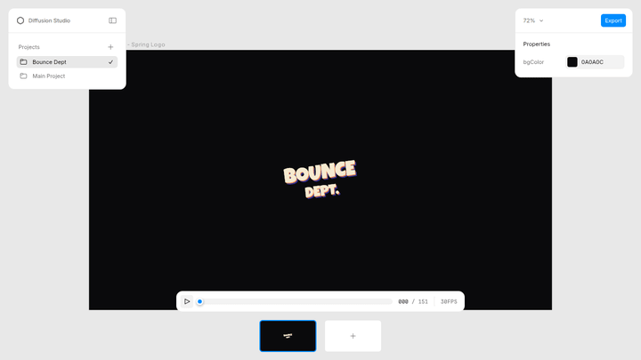

# BOUNCE DEPT. — Spring Bounce Logo

A Lottie/Skottie animation of the **BOUNCE DEPT.** wordmark, built with the
`text-to-lottie` skill for the local Skia Skottie player.



## Motion beats (30 fps, 152 frames ≈ 5s)

1. **Spring pulse ×4** — logo springs small→big four times in place.
2. **Tumble roll** — rolls to the left with bounces, then rolls back and finds
   its place (center).
3. **Settle pop** — a small overshoot grow as it locks up.
4. **Cat peek** — a cat pokes its face out above the **B**, then ducks back in.

## Files

- `scene-1/lottie.json` — the animation (1920×1080, transparent-safe on black).
- `scene-1/LuckiestGuy.ttf` — display font (embedded family: *Luckiest Guy*).
- `scene-1/controls.json` — exposes the `bgColor` slot in the player panel.
- `../../tools/bounce-dept.gen.cjs` — generator that rebuilds `lottie.json`.

## Preview / edit

Scaffold the official player, then drop this project under `public/projects/`:

```bash
npx degit diffusionstudio/lottie my-animation
cd my-animation
npm install
npm run dev   # open the printed URL, then /bounce-dept/scene-1
```

Rebuild the JSON after editing the generator:

```bash
node tools/bounce-dept.gen.cjs
```
